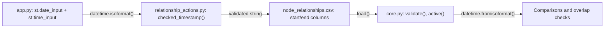

# Plan: Date to Timestamp Migration

## Context

The `start` and `end` columns in `node_relationships` currently store date strings (`YYYY-MM-DD`). The user wants these changed to store timestamps (`YYYY-MM-DDTHH:MM:SS`).

This touches **3 Python files** and **2 CSV files**:

### Files to modify

| File                             | What changes                                                                   |
| -------------------------------- | ------------------------------------------------------------------------------ |
| relationship\_actions.py         | `checked_day()` parsing, error messages, comparison logic                      |
| core.py                          | `validate()` date parsing, `active()` comparison, overlap sentinel value       |
| app.py                           | `st.date_input` widgets become date+time, `.isoformat()` calls, display labels |
| data/node\_relationships.csv     | Existing `2026-01-01` values become `2026-01-01T00:00:00`                      |
| data/node\_relationships.csv.bak | Same migration                                                                 |

### How timestamps flow through the code



---

## Step 1: Update `relationship_actions.py`

**Current** (`checked_day`, line 7-14):

```python
from datetime import date

def checked_day(value):
    try:
        parsed=date.fromisoformat(value)
    except (ValueError,TypeError):
        raise ValueError('Use a valid YYYY-MM-DD date') from None
    if parsed.isoformat()!=value:
        raise ValueError('Use YYYY-MM-DD dates')
    return parsed
```

**New** (rename to `checked_ts`):

```python
from datetime import datetime

def checked_ts(value):
    try:
        parsed=datetime.fromisoformat(value)
    except (ValueError,TypeError):
        raise ValueError('Use a valid timestamp (YYYY-MM-DDTHH:MM:SS)') from None
    return parsed
```

The roundtrip check (`parsed.isoformat()!=value`) can be dropped because `datetime.fromisoformat` is strict enough. The function name changes from `checked_day` to `checked_ts`.

**Update all call sites** within the same file (5 occurrences):

- Line 18-19: `checked(db)` calls `checked_day` -> `checked_ts`
- Line 33: `existing_open` calls `checked_day` -> `checked_ts`
- Line 38: comparison `checked_day(day)<=checked_day(r['start'])` -> `checked_ts(day)<=checked_ts(r['start'])`
- Line 39: error message update to mention timestamp instead of date
- Line 43: `add_relationship` calls `checked_day` -> `checked_ts`

The comparison operator `<=` still works the same way between two `datetime` objects.

The error message on line 39 changes from:

```
'Effective date must be later than the existing start date. Date-only storage cannot represent a same-day interval.'
```

to:

```
'Effective timestamp must be later than the existing start timestamp.'
```

---

## Step 2: Update `core.py`

### `active()` function (line 43)

**Current:**

```python
def active(r,day): return r['start']<=day and (not r['end'] or day<r['end'])
```

No change needed here -- string comparison of ISO timestamps (`'2026-01-01T00:00:00' <= '2026-01-01T12:00:00'`) works correctly because ISO 8601 format is lexicographically ordered. The `day` parameter passed from `app.py` will now also be a timestamp string.

### `validate()` function (lines 82-86)

**Current:**

```python
        date.fromisoformat(r['start'])
        if r['end']: date.fromisoformat(r['end'])
```

**New:**

```python
        datetime.fromisoformat(r['start'])
        if r['end']: datetime.fromisoformat(r['end'])
```

Add `datetime` to the import: `from datetime import date, datetime`

The error message on line 86 can optionally be updated from `'invalid date interval'` to `'invalid timestamp interval'`.

### Overlap detection (line 95)

**Current sentinel:**

```python
a['start']<(b['end'] or '9999-12-31') and b['start']<(a['end'] or '9999-12-31')
```

**New sentinel:**

```python
a['start']<(b['end'] or '9999-12-31T23:59:59') and b['start']<(a['end'] or '9999-12-31T23:59:59')
```

The sentinel must be a timestamp string now so comparisons remain consistent.

---

## Step 3: Update `app.py`

### Import (line 1)

**Current:**

```python
from datetime import date
```

**New:**

```python
from datetime import date, datetime, time
```

(`date` is still used for `st.date_input` defaults; `time` for `st.time_input` defaults)

### Add relationship form (around line 309)

**Current:**

```python
start=st.date_input('Start date',date.today())
...
d=add_relationship(db,hid,level,parent,child,start.isoformat())
```

**New:**

```python
sc1,sc2=st.columns(2)
start_d=sc1.date_input('Start date',date.today())
start_t=sc2.time_input('Start time',time(0,0))
...
start_ts=datetime.combine(start_d,start_t).isoformat()
d=add_relationship(db,hid,level,parent,child,start_ts)
```

### Modify relationship form (around line 336)

**Current:**

```python
when=st.date_input('Effective change date',date.today())
...
d=modify_relationship(db,rid,parent,when.isoformat())
```

**New:**

```python
wc1,wc2=st.columns(2)
when_d=wc1.date_input('Effective change date',date.today())
when_t=wc2.time_input('Effective time',time(0,0))
...
when_ts=datetime.combine(when_d,when_t).isoformat()
d=modify_relationship(db,rid,parent,when_ts)
```

### End relationship form (around line 344)

**Current:**

```python
when=st.date_input('End date',date.today())
...
d=end_relationship(db,rid,when.isoformat())
```

**New:**

```python
ec1,ec2=st.columns(2)
when_d=ec1.date_input('End date',date.today())
when_t=ec2.time_input('End time',time(0,0))
...
when_ts=datetime.combine(when_d,when_t).isoformat()
d=end_relationship(db,rid,when_ts)
```

### Relationship label display (around line 324)

**Current:**

```python
return f"ID {x}: {label(r['parent'])} -> {label(r['child'])} | Start: {r['start']}"
```

No change needed -- the start value will now just be a longer string showing the full timestamp.

### Hierarchy Explorer "As of date" (line 363)

**Current:**

```python
day=st.date_input('As of date',date.today()).isoformat()
```

**New:**

```python
dc1,dc2=st.columns(2)
as_d=dc1.date_input('As of date',date.today())
as_t=dc2.time_input('As of time',time(23,59,59))
day=datetime.combine(as_d,as_t).isoformat()
```

Default time is `23:59:59` here so that "as of today" captures everything that happened today.

### Caption text (line 264)

Update from `'Dates are effective dates.'` to `'Timestamps are effective timestamps. End is exclusive. Closed rows remain in history.'`

### Validation success message (line 356-357)

Update from `'date intervals'` to `'timestamp intervals'`.

---

## Step 4: Migrate existing CSV data

Convert all existing date values in `data/node_relationships.csv` and `data/node_relationships.csv.bak` from `YYYY-MM-DD` to `YYYY-MM-DDTHH:MM:SS` by appending `T00:00:00` to every non-empty start and end value.

Example:

```
# Before
1,1,1,0,10005,2026-01-01,

# After
1,1,1,0,10005,2026-01-01T00:00:00,
```

End values that are empty stay empty.

---

## Step 5: Test verification

After all changes:

1. Load the app -- existing data should display without errors
2. Validation tab should pass with no errors
3. Add a new relationship -- timestamp should be stored in CSV
4. Modify a relationship -- effective timestamp must be after start
5. End a relationship -- end timestamp stored correctly
6. Hierarchy Explorer -- "As of" filtering works with timestamps
7. Overlap detection still catches conflicting assignments

---

## Critical Files

- relationship\_actions.py -- Validation and parsing logic (checked\_day -> checked\_ts)
- core.py -- validate(), active(), and overlap detection
- app.py -- All UI date inputs become date+time combos
- data/node\_relationships.csv -- Existing data migration
