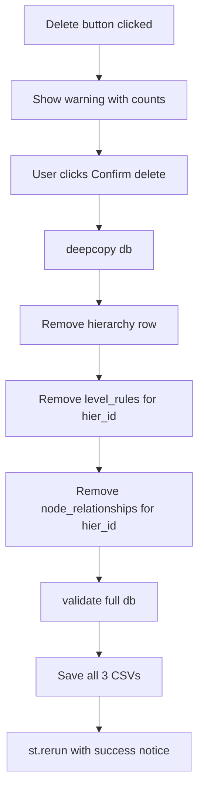

# Plan: Delete Hierarchy

## Context

The Hierarchies and Rules tab (`app.py:187-216`) currently supports:

- **Create** a new hierarchy (form with name input)
- **Edit** an existing hierarchy (name + active checkbox)
- **Save level rules** (multiselect chain, blocked if relationships exist)

There is **no delete** capability. The user wants to permanently delete a hierarchy.

### Key findings

- A hierarchy (`db['hierarchies']`) has child data in two other tables:

  - `db['level_rules']` — rules defining the parent-child type chain per level
  - `db['node_relationships']` — actual parent-child relationship rows

- The existing node delete pattern (`app.py:170-185`) uses a guard: it blocks deletion if the node is referenced in relationships.

- The `commit()` function (`app.py:100-103`) saves **one table at a time** via `core.save()`. Deleting a hierarchy requires removing rows from 3 tables, so we need a multi-table save.

- `core.save()` validates the **entire** `db` dict before writing, and backs up the CSV before overwriting.

### Design decision: guard vs cascade

Two approaches for hierarchies that have relationships:

1. **Guard** — block delete if any `node_relationships` exist for this `hier_id` (like the node delete pattern)
2. **Cascade** — delete the hierarchy along with all its rules and relationships

I recommend **cascade delete with confirmation**, because:

- Unlike nodes (which are shared across hierarchies), relationships and rules belong exclusively to one hierarchy
- Blocking delete would force users to manually end every relationship first, which is tedious
- A clear confirmation warning with a count of affected rows is sufficient protection

### Affected data flow



## Implementation steps

### Step 1: Extend `commit` for multi-table saves

In app.py around line 100, modify `commit()` to accept a list of tables:

```python
def commit(candidate, table):
    try:
        tables = table if isinstance(table, list) else [table]
        for t in tables:
            save(candidate, t)
    except (ValueError, OSError) as e: st.error(str(e)); return
    st.session_state['notice'] = 'Saved successfully.'; st.rerun()
```

This is backward-compatible — existing single-table calls like `commit(d, 'hierarchies')` still work. The cascade delete will call `commit(d, ['hierarchies', 'level_rules', 'node_relationships'])`.

### Step 2: Add delete UI in the Hierarchies and Rules page

In app.py, after the "Save hierarchy" form (around line 200), add a delete button with session-state-driven confirmation:

```python
# Delete hierarchy — after the edit form, before rules display
if st.button('Delete hierarchy', icon=':material/delete:', type='tertiary'):
    st.session_state['confirm_delete_hier'] = hid

if st.session_state.get('confirm_delete_hier') == hid:
    rel_count = sum(1 for r in db['node_relationships'] if r['hier_id'] == hid)
    rule_count = sum(1 for r in db['level_rules'] if r['hier_id'] == hid)
    st.warning(
        f'This will permanently delete hierarchy "{selected["hier_desc"]}" '
        f'along with {rule_count} level rule(s) and {rel_count} relationship row(s). '
        f'This cannot be undone.'
    )
    dc1, dc2, _ = st.columns([2, 2, 4])
    if dc1.button('Confirm delete', icon=':material/delete_forever:', type='primary'):
        d = copy.deepcopy(db)
        d['hierarchies'] = [h for h in d['hierarchies'] if h['hier_id'] != hid]
        d['level_rules'] = [r for r in d['level_rules'] if r['hier_id'] != hid]
        d['node_relationships'] = [r for r in d['node_relationships'] if r['hier_id'] != hid]
        st.session_state.pop('confirm_delete_hier', None)
        commit(d, ['hierarchies', 'level_rules', 'node_relationships'])
    if dc2.button('Cancel', icon=':material/close:'):
        st.session_state.pop('confirm_delete_hier', None)
        st.rerun()
```

Key behaviors:

- The "Delete hierarchy" button is always visible below the edit form
- Clicking it reveals a warning with exact counts of rules and relationships that will be removed
- "Confirm delete" performs the cascading removal and saves all 3 tables
- "Cancel" dismisses the confirmation
- After delete, the page reruns and the hierarchy selector defaults to the first remaining hierarchy

### Step 3: Handle edge case — last hierarchy

If the user deletes the last hierarchy, `hselect()` (the hierarchy dropdown used across tabs) will have no options. Need to guard against this. Looking at `hselect` usage, it likely uses `st.selectbox` which would error on an empty list.

Add a guard after the create form:

```python
if not db['hierarchies']:
    st.info('No hierarchies exist. Create one above.')
    st.stop()
```

This should go right after the "Create hierarchy" form and before `hselect('rules_h')`.

### Step 4: Clean up session state on delete

Reset `confirm_delete_hier` and any related session state keys (`rules_h` selector) to avoid stale references after deletion.

## Verification

1. **Delete empty hierarchy** — create a new hierarchy with no rules/relationships, delete it. Confirm it disappears from the dropdown.
2. **Delete hierarchy with data** — delete the DEMO hierarchy (has rules + relationships). Confirm all 3 CSVs are updated and the `.bak` files contain the old data.
3. **Cancel delete** — click Delete, see the warning, click Cancel. Confirm nothing changed.
4. **Validation tab** — after delete, confirm "Structural validation passed" still shows.
5. **Other tabs** — confirm Relationships, Hierarchy Explorer still work with remaining hierarchies (or show appropriate empty state).

## Critical files

- `app.py` — Hierarchies and Rules page section (lines 187-216) and `commit()` function (line 100)
- `core.py` — `save()` and `validate()` functions (for reference, no changes needed)
- `data/hierarchies.csv` — will have rows removed on delete
- `data/level_rules.csv` — will have rows removed on delete
- `data/node_relationships.csv` — will have rows removed on delete
