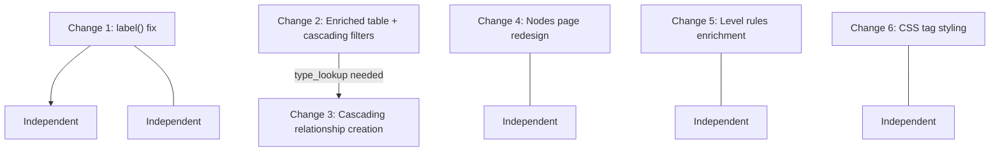

# Merge Handoff: All Changes to `app.py`

All changes are in **`app.py`** only. The data CSV files also changed during testing (new hierarchies, relationships, renamed nodes) but those are test data and not code changes.

---

## Change 1: Fix Graphviz node label rendering

**Problem:** The `label()` function used a Unicode middle dot (`U+00B7`) which Graphviz rendered as literal text `u00B7` in the tree diagram.

**Location:** The `label()` helper function (around line 104 in original).

**Original:**
```python
def label(n):
    r=next(r for r in db['nodes'] if r['node_id']==n)
    return f"{r['node_name']} \u00b7 ID {n}"
```

**New:**
```python
def label(n):
    r=next(r for r in db['nodes'] if r['node_id']==n)
    return f"{r['node_name']} - ID {n}"
```

Only change: replace ` \u00b7 ` (middle dot) with ` - ` (hyphen).

---

## Change 2: Enriched Relationships table with cascading filters

**Problem:** The Relationships table showed raw IDs for hier_id, level, parent, child. Filters were independent -- selecting Level 7 still showed all parents in the Parent filter, not just those appearing in level 7 rows.

**Location:** Inside `elif page=='Relationships':` block, right after `hid=hselect('rel_h')`.

**Original:**
```python
elif page=='Relationships':
    hid=hselect('rel_h')
    show([r for r in db['node_relationships'] if r['hier_id']==hid])
```

**New (replace the `show(...)` line with this entire block):**
```python
    node_lookup={n['node_id']:n for n in db['nodes']}
    type_lookup={t['node_type_id']:t['node_type_name'] for t in db['node_types']}
    hier_lookup={h['hier_id']:h['hier_desc'] for h in db['hierarchies']}
    rule_lookup={r['level']:r for r in db['level_rules'] if r['hier_id']==hid}
    rel_rows=[r for r in db['node_relationships'] if r['hier_id']==hid]
    if rel_rows:
        rel_df=pd.DataFrame(rel_rows)
        def enrich_node(nid):
            n=node_lookup.get(nid)
            return f"{nid} - ({n['node_name']})" if n else nid
        def enrich_level(lvl):
            r=rule_lookup.get(lvl)
            if not r: return lvl
            ptype=type_lookup.get(r['parent_node_type'],'')
            ctype=type_lookup.get(r['child_node_type'],'')
            return f"{lvl} - {ptype} \u2192 {ctype}"
        rel_df['hier_id']=rel_df['hier_id'].map(lambda x:f"{x} - {hier_lookup.get(x,x)}")
        rel_df['level']=rel_df['level'].apply(enrich_level)
        rel_df['parent']=rel_df['parent'].apply(enrich_node)
        rel_df['child']=rel_df['child'].apply(enrich_node)
        with st.expander('Filters',icon=':material/filter_alt:'):
            fc1,fc2,fc3=st.columns(3)
            f_level=fc1.multiselect('Level',sorted(rel_df['level'].unique()),key='rel_f_level')
            _after_level=rel_df[rel_df['level'].isin(f_level)] if f_level else rel_df
            parent_opts=sorted(_after_level['parent'].unique())
            if 'rel_f_parent' in st.session_state:
                st.session_state['rel_f_parent']=[v for v in st.session_state['rel_f_parent'] if v in parent_opts]
            f_parent=fc2.multiselect('Parent',parent_opts,key='rel_f_parent')
            _after_parent=_after_level[_after_level['parent'].isin(f_parent)] if f_parent else _after_level
            child_opts=sorted(_after_parent['child'].unique())
            if 'rel_f_child' in st.session_state:
                st.session_state['rel_f_child']=[v for v in st.session_state['rel_f_child'] if v in child_opts]
            f_child=fc3.multiselect('Child',child_opts,key='rel_f_child')
        display_df=_after_parent[_after_parent['child'].isin(f_child)] if f_child else _after_parent
        st.dataframe(display_df,use_container_width=True,hide_index=True)
    else:
        st.info('No relationships for this hierarchy.')
```

**How the cascading filters work:**
- Level filter narrows the DataFrame
- Parent filter options are computed from the level-filtered DataFrame
- Child filter options are computed from the level+parent filtered DataFrame
- `st.session_state` cleanup removes stale selections when upstream filters narrow the options

---

## Change 3: Cascading relationship creation with level locking

**Problem:** The Level dropdown showed all levels. Users could add relationships at any level without building from level 1 upward. Parents at level N showed all nodes of the parent type, not just children from level N-1.

**Location:** Same `elif page=='Relationships':` block, the section after the table display that handles add/modify/end relationship forms.

**Original:**
```python
    rules=sorted([r for r in db['level_rules'] if r['hier_id']==hid], key=lambda r:int(r['level']))
    if not rules:
        st.warning('Define level rules first.'); st.stop()
    level=st.selectbox('Level',[r['level'] for r in rules])
    rule=next(r for r in rules if r['level']==level)
    parents=[n['node_id'] for n in db['nodes'] if n['node_type_id']==rule['parent_node_type']]
    children=[n['node_id'] for n in db['nodes'] if n['node_type_id']==rule['child_node_type']]
    if not parents or not children:
        st.warning('Add nodes of the required types first.'); st.stop()
    action=st.radio('Action',['Add new relationship','Modify relationship','End relationship'])
    st.caption('Dates are effective dates. End is exclusive. Closed rows remain in history.')
    if action=='Add new relationship':
        with st.form('add_relationship'):
            parent=st.selectbox('Parent',parents,format_func=label)
            child=st.selectbox('Child',children,format_func=label)
            ...
```

**New (replace the entire block from `rules=sorted(...)` through the form handling):**
```python
    rules=sorted([r for r in db['level_rules'] if r['hier_id']==hid], key=lambda r:int(r['level']))
    if not rules:
        st.warning('Define level rules first.'); st.stop()
    def level_label(lvl):
        r=next((r for r in rules if r['level']==lvl),None)
        if not r: return lvl
        return f"{lvl} - {type_lookup.get(r['parent_node_type'],'')} \u2192 {type_lookup.get(r['child_node_type'],'')}"
    existing_rels=[r for r in db['node_relationships'] if r['hier_id']==hid and not r['end']]
    levels_with_data={r['level'] for r in existing_rels}
    action=st.radio('Action',['Add new relationship','Modify relationship','End relationship'])
    st.caption('Dates are effective dates. End is exclusive. Closed rows remain in history.')
    # determine unlocked levels based on action
    all_levels=[r['level'] for r in rules]
    if action=='Add new relationship':
        unlocked=set()
        for i,r in enumerate(rules):
            lvl=r['level']
            if i==0:
                unlocked.add(lvl)
            elif rules[i-1]['level'] in levels_with_data:
                unlocked.add(lvl)
            else:
                break
        def add_level_label(lvl):
            base=level_label(lvl)
            return base if lvl in unlocked else f"\U0001f512\uFE0E {base} (complete previous level first)"
        level=st.selectbox('Level',all_levels,format_func=add_level_label)
        if level not in unlocked:
            st.warning('Complete relationships at the previous level before adding to this level.')
            st.stop()
    else:
        available_levels=[r['level'] for r in rules if r['level'] in levels_with_data]
        if not available_levels:
            st.info('No relationships exist yet for this hierarchy.'); st.stop()
        level=st.selectbox('Level',available_levels,format_func=level_label)
    rule=next(r for r in rules if r['level']==level)
    rule_idx=next(i for i,r in enumerate(rules) if r['level']==level)
    # parent filtering: for Add, cascade from previous level's children
    if action=='Add new relationship':
        if rule_idx==0:
            parents=[n['node_id'] for n in db['nodes'] if n['node_type_id']==rule['parent_node_type']]
        else:
            prev_level=rules[rule_idx-1]['level']
            parents=sorted({r['child'] for r in existing_rels if r['level']==prev_level})
        if not parents:
            st.warning('Complete the previous level first to unlock parent options.'); st.stop()
    else:
        parents=[n['node_id'] for n in db['nodes'] if n['node_type_id']==rule['parent_node_type']]
    children=[n['node_id'] for n in db['nodes'] if n['node_type_id']==rule['child_node_type']]
    if not parents or not children:
        st.warning('Add nodes of the required types first.'); st.stop()
    if action=='Add new relationship':
        with st.form('add_relationship'):
            parent=st.selectbox('Parent',parents,format_func=label)
            child=st.selectbox('Child',children,format_func=label)
            ...  # rest of form unchanged
```

**Key behavioral changes:**
1. **Action radio moved above Level selector** -- action determines which levels are available
2. **Add mode -- all levels visible, locked ones shown with lock icon** -- users must build sequentially from level 1. The `\U0001f512\uFE0E` renders a monochrome grey padlock. Selecting a locked level shows a warning and stops.
3. **Add mode -- parent cascading** -- for level N > 1, parents come from `{r['child'] for r in existing_rels if r['level']==prev_level}` (children of previous level). For level 1, parents are all nodes of the root type.
4. **Modify/End mode** -- only levels with existing relationships are shown (no lock indicators, no sequential restriction)
5. **Level labels enriched** -- shows `"1 - Root -> Area"` format instead of raw level number

**Note:** This change depends on `type_lookup` being defined earlier (from Change 2). If your colleague is merging only Change 3 without Change 2, they need to add `type_lookup={t['node_type_id']:t['node_type_name'] for t in db['node_types']}` before the `rules=sorted(...)` line.

---

## Change 4: Nodes page redesign (Add/Edit/Delete buttons)

**Problem:** The original Nodes page had a simple "Add node" form and a "Rename node" selectbox+form. There was no delete capability, and the UX was not structured.

**Location:** The `elif page=='Nodes':` block.

This is a large rewrite. The original had a simple flow:
```
selectbox(Node type) -> show(filtered nodes) -> form(Add node) -> selectbox(Rename) -> form(Rename)
```

The new design uses a three-button pattern (Add / Edit / Delete) with `st.session_state['nodes_mode']` tracking the active mode. The full replacement code is visible in the git diff. Key features:
- **Add mode**: Form with node name input, Done/Cancel buttons
- **Edit mode**: Uses `st.data_editor` for inline editing of node names
- **Delete mode**: Uses `st.dataframe` with `selection_mode='multi-row'` for multi-select deletion with relationship protection check
- Root type nodes cannot be added or deleted (buttons disabled)

---

## Change 5: Level rules display enrichment

**Problem:** The Hierarchies and Rules tab showed raw node type IDs in the level rules table.

**Location:** Inside `elif page=='Hierarchies & rules':`, where level rules are displayed.

**Original:**
```python
    show([r for r in db['level_rules'] if r['hier_id']==hid])
```

**New:**
```python
    type_map={t['node_type_id']:f"{t['node_type_id']} - {t['node_type_name']}" for t in db['node_types']}
    rules_display=pd.DataFrame([r for r in db['level_rules'] if r['hier_id']==hid])
    if not rules_display.empty:
        rules_display['parent_node_type']=rules_display['parent_node_type'].map(type_map)
        rules_display['child_node_type']=rules_display['child_node_type'].map(type_map)
    st.dataframe(rules_display,use_container_width=True,hide_index=True)
```

---

## Change 6: CSS tag styling fix

**Location:** The CSS `<style>` block at the top of `app.py` (around line 68).

**Original:**
```css
[data-baseweb="tag"] { background:#1010EB !important; } [data-baseweb="tag"] * { color:#fff !important; -webkit-text-fill-color:#fff !important; }
```

**New:**
```css
[data-baseweb="tag"] { background:#1010EB !important; } [data-baseweb="tag"], [data-baseweb="tag"] *, [data-baseweb="tag"] span, [data-baseweb="tag"] svg { color:#fff !important; -webkit-text-fill-color:#fff !important; fill:#fff !important; }
span[data-tag] { background:#1010EB !important; } span[data-tag], span[data-tag] * { color:#fff !important; -webkit-text-fill-color:#fff !important; fill:#fff !important; }
```

This ensures multiselect tag pills, including their SVG close icons, render with white text/icons on the blue background.

---

## Dependencies between changes



- Changes 1, 4, 5, 6 are fully independent and can be merged in any order
- Change 3 depends on `type_lookup` and `node_lookup` dictionaries introduced in Change 2. Merge Change 2 first, or add the lookup definitions before Change 3's code.

---

## Critical file

- [app.py](app.py) -- the only file with code changes. All logic is here.
- Data CSV files changed during testing but those are runtime data, not code.
